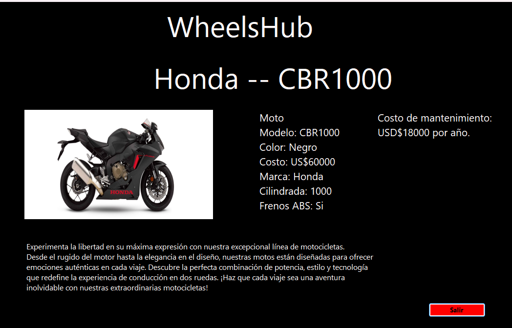

# WheelsHub.

## Desarrollado por: 
- Diego Uthurburu

## Proyecto: Es una App de catalogo de Vehiculos desarrollada en C#.

## Descripción
WheelsHub es una aplicación que te permite gestionar un catálogo de vehículos. Puedes realizar diversas operaciones como agregar, modificar, borrar y ordenar la lista de vehículos. La aplicación también cuenta con un sistema de inicio de sesión que valida usuarios y gestiona los permisos de acceso. Además, hay una función para visualizar los registros de inicio de sesión de otros usuarios.

## Objetivo: 
El objetivo principal de WheelsHub es proporcionar una interfaz intuitiva para gestionar y explorar un catálogo de vehículos. La aplicación garantiza la seguridad de la información mediante un sistema de inicio de sesión y gestiona los permisos de los usuarios para asegurar un acceso controlado a las funcionalidades.

## Menú de Opciones Intuitivo:
WheelsHub presenta un menú de opciones intuitivo que facilita la gestión del catálogo de vehículos. Puedes agregar nuevos vehículos, modificar detalles, eliminar registros y ordenar la lista según tus preferencias. La interfaz de usuario está diseñada para ofrecer una experiencia fácil y eficiente.

## Diagrama de clases:

## Clase Base: 

## Clases derivadas:

## Auto:

## Moto:

## Camion:

 

## Funciones:

## Inicio de sesion:

## Vistas del catalogo: 

## Agregar un nuevo Vehiculo:

---
### Fuentes
- [Consejos para documentar](https://www.sohamkamani.com/how-to-write-good-documentation/#architecture-documentation).

- [Lenguaje Markdown](https://markdown.es/sintaxis-markdown/#linkauto).

- [Markdown Cheatsheet](https://github.com/adam-p/markdown-here/wiki/Markdown-Cheatsheet).

- [Tutorial](https://www.youtube.com/watch?v=oxaH9CFpeEE).

- [Emojis](https://gist.github.com/rxaviers/7360908).